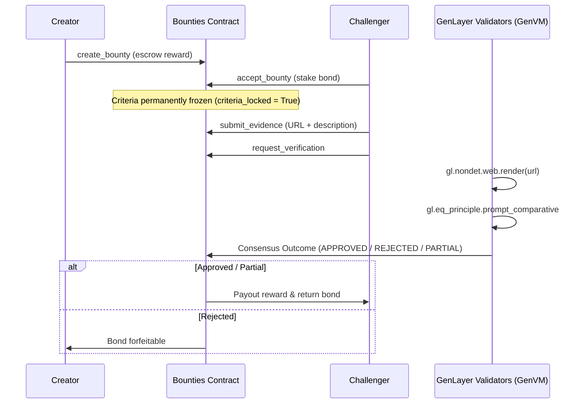

# Bounties Architecture & Protocol Mechanics

## 1. System Overview

Bounties operates as an autonomous protocol on GenLayer. It coordinates between three parties:
- **Creators:** Create public claim bounties, escrow rewards, and define frozen acceptance criteria.
- **Challengers:** Stake bonds and submit verifiable public web URLs as evidence.
- **Validators:** Independent GenVM nodes that fetch live web pages and execute prompt evaluations through the Equivalence Principle.

## 2. Avoiding Undetermined / Non-Deterministic Divergence

In GenLayer's Equivalence Principle:
1. `reasoning` is free-text and excluded from byte equality comparisons.
2. `payout_bps` for PARTIAL settlements is discretized into 500-basis-point buckets (`_bucket_payout_bps`) inside the non-deterministic closure before comparison. This guarantees validators agree on exact financial outcomes.
3. Web fetching is bounded to `WEB_FETCH_CHAR_LIMIT = 12_000` characters to prevent context window exhaustion.

## 3. Reentrancy & Economic Conservation

All fund movements route through `_send_gen`, using GenLayer's `@gl.evm.contract_interface` bridge. Every method implements strict zero-then-transfer discipline:
1. Read ledger balance.
2. Zero or reduce state ledger.
3. Commit terminal status.
4. Execute external transfer.
