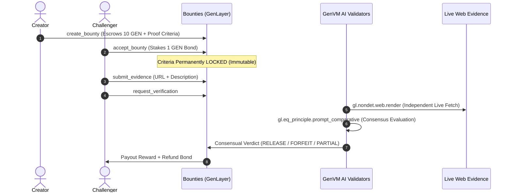

# Introducing Bounties: Autonomous Verification & Claim Consensus on GenLayer

### How we built an adversarial Web3 claim marketplace where independent AI validators settle subjective truth against live web evidence.

---

### The Oracle Bottleneck in Web3

Traditional blockchains excel at deterministic arithmetic: balances, hashes, and token transfers. Numeric price oracles (like Chainlink) bridged the first gap by feeding standardized numbers onto EVM networks. 

**But what happens when real economic value depends on human language and qualitative facts?**
* *Did an open-source team actually deliver the API specified in a grant proposal?*
* *Does a company’s privacy documentation contain a specific safety guarantee?*
* *Did a public regulatory decision or network milestone occur as claimed?*

Until now, decentralized protocols have relied on two flawed approaches:
1. **Centralized Escrow Arbiters:** Third-party human judges who create single points of failure, extortion risk, and censorship.
2. **Single-API LLM Oracles:** Calling a centralized AI API (like OpenAI or Claude) from a backend server. Whoever holds the API key controls the prompt, pays the judge, and can manipulate what evidence the model even sees.

To solve this, we built **Bounties** on [GenLayer](https://genlayer.com) — an autonomous, non-custodial protocol where creators escrow capital against claims, challengers stake bonds with live web evidence, and **decentralized GenLayer validators independently fetch the web and reach consensus using the Equivalence Principle.**

---

### Why Bounties Fundamentally Requires GenLayer

Bounties cannot exist on standard EVM chains or with off-chain bots because of three core economic properties:

#### 1. Diametrically Opposed Financial Incentives
The creator of a bounty wants the claim to fail so they retain their escrowed reward. The challenger wants it to succeed so they earn the payout. Neither party, nor a centralized backend operator, can serve as the judge without introducing moral hazard. GenLayer’s validator set has no financial stake in the outcome; they are incentivized solely by consensus integrity.

#### 2. The Evidence is Live, External, and Adversarial
If a challenger submits a URL as proof, a centralized server saying *"I checked the URL, it looks good"* asks every participant to trust that operator blindly. Inside GenLayer’s **GenVM**, multiple independent validators execute `gl.nondet.web.render` to fetch the raw webpage content themselves at execution time. No party’s claimed fetch is ever taken on faith.

#### 3. Irreversible Financial Transfers
When an outcome is decided, smart contract funds move immediately. Using GenLayer’s `gl.eq_principle.prompt_comparative`, independent validators evaluate the live-fetched text against precommitted criteria and must converge on equivalent semantic judgments before transactions settle.

---

### How Bounties Works Under the Hood

#### Step 1: Bonded Escrow Creation (`create_bounty`)
A creator deposits GEN tokens into the contract, defines a factual claim, and outlines clear, structured proof criteria. The reward is locked securely in the contract state.

#### Step 2: The Immutable Criteria Freeze (`accept_bounty`)
In many bounty platforms, corrupt creators move the goalposts once work begins. In Bounties, the moment a challenger stakes their required bond, the smart contract permanently sets `criteria_locked = True`. From this second onward, the creator cannot alter or edit a single word of the criteria.

#### Step 3: Evidence Submission (`submit_evidence`)
The challenger submits the public URL (e.g. official documentation, GitHub release, or public explorer transaction) and a brief description.

#### Step 4: Autonomous Multi-Validator Consensus
When verification is requested:
* Multiple GenLayer validators independently fetch the URL directly from the public internet.
* Validators extract the actual rendered content and evaluate it against the frozen criteria.
* Payout percentages are mapped into discrete economic buckets (`_bucket_payout_bps`) to ensure mathematical consensus on partial claims.
* Payouts execute using strict **zero-then-transfer** state updates, guaranteeing full reentrancy and drain protection.

---

### The Live Protocol & Architecture

We built and deployed Bounties end-to-end with a dedicated intelligent contract and a modern cyber-slate Web3 application:

* **Intelligent Contract:** [`bounties.py`](https://github.com/Dark-Brain07/Bounties/blob/main/contracts/bounties.py) written natively for GenLayer (`gl.Contract`), featuring deterministic `TreeMap` storage, multi-attempt concurrency guards (`MAX_ATTEMPTS_PER_BOUNTY = 40`), and FNV-1a fingerprinting.
* **Frontend DApp:** Built with **Next.js 14**, Tailwind CSS, and glassmorphic UI, featuring real-time consensus monitoring, interactive evidence submission, and a built-in StudioNet faucet.
* **Dual Wallet Support:** Supports standard browser extensions (**MetaMask**, Rabby) as well as an **Instant StudioNet Signer** that pre-funds a burner wallet with 2,000 GEN testnet tokens for zero-barrier testing.

---

### Verify and Test Bounties Today

The Bounties protocol is live and verified on the GenLayer StudioNet:

* 🌐 **Live Web Application:** [bounties-xi.vercel.app](https://bounties-xi.vercel.app)
* 📜 **StudioNet Contract:** [`0xeBdE3fE16D05eE4DCA5096F4633FcEE92232877F`](https://explorer-studio.genlayer.com/address/0xeBdE3fE16D05eE4DCA5096F4633FcEE92232877F)
* 💻 **Open-Source GitHub:** [github.com/Dark-Brain07/Bounties](https://github.com/Dark-Brain07/Bounties)
* 📚 **Technical Architecture:** [Read ARCHITECTURE.md](https://github.com/Dark-Brain07/Bounties/blob/main/docs/ARCHITECTURE.md)

---

### Tags for Medium / Mirror
`Web3` · `GenLayer` · `Artificial Intelligence` · `Smart Contracts` · `Blockchain Oracles`
